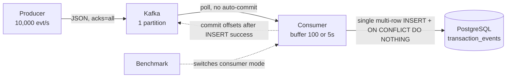
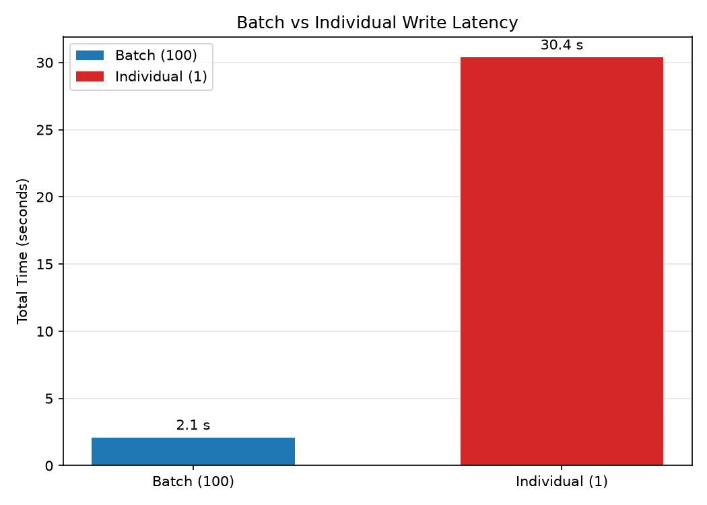

# Kafka to PostgreSQL Streaming Pipeline

A producer generates 10,000 synthetic financial events per second. Kafka carries them to a consumer. The consumer buffers them in memory and batch-writes to PostgreSQL. One `docker compose up` boots the entire stack.

Built for an MSc demonstration of distributed data engineering: at-least-once delivery with idempotent consumer deduplication across two independent systems, plus an empirical benchmark that compares batched persistence against row-by-row insertion.

**Problem.** Fixed, unmeasured ingestion pipelines either over-provision and waste compute, or under-provision and drop events under burst load. Naive consumers write one row per event. Postgres lock contention, WAL pressure, and CPU saturation follow. Nobody can say how much slower individual writes actually are, because nobody measured.

**Solution.** A fully containerized pipeline: Faker-driven producer at 10,000 events/sec, Kafka as the buffer, a Python consumer that flushes multi-row `INSERT ... ON CONFLICT DO NOTHING` batches, and PostgreSQL as the sink. Offsets commit only after a successful database write. Duplicates are rejected server-side on the `event_id` primary key. An end-to-end benchmark runs the same 10,000 events twice, once with batch size 100 and once with batch size 1, and reports wall-clock time, throughput, and batch INSERT latency for both modes.

**Impact.** Zero data loss when Postgres is down, because the consumer holds the batch and retries without committing. Effectively exactly-once semantics across Kafka and Postgres without a distributed transaction. A measured, reproducible answer to the batch-versus-individual question, with the chart generated by the benchmark itself.

---

## Architecture

```
┌──────────┐  produce 10K/s   ┌──────────┐  poll (no auto-commit)  ┌──────────┐  multi-row INSERT   ┌──────────┐
│ Producer │ ───────────────▶ │  Kafka   │ ───────────────────────▶ │ Consumer │ ─────────────────▶ │ Postgres │
│ (Python) │   JSON, acks=all │ (Docker) │   raw-logs, 1 partition │ (Python) │  ON CONFLICT        │ (Docker) │
└──────────┘                  └──────────┘                          └──────────┘  DO NOTHING         └──────────┘
     │                             │                                    │  ▲                            │
     │                             │  Zookeeper                         │  └─ commit(offset+1) ──────────┘
     │                             └────────────────────────────────────┘        only after INSERT success
     │
     └─ Benchmark (host-run) drives the cycle: stop → TRUNCATE → reset offsets → restart with BATCH_SIZE → produce → poll
```



| Service | Role | Notes |
|---|---|---|
| `zookeeper` | Kafka coordination | `confluentinc/cp-zookeeper:7.8.0`, TCP healthcheck |
| `kafka` | Broker | `confluentinc/cp-kafka:7.8.0`, dual listeners: `PLAINTEXT://kafka:9092` (in-container) and `PLAINTEXT_HOST://localhost:9093` (host access), 1 partition, auto topic creation |
| `postgres` | Sink | `postgres:16`, database `streamingdb`, schema from `db/init.sql` on first boot |
| `producer` | Source | Generates 10,000 events/sec with Faker, `acks=all` |
| `consumer` | Buffer + writer | Polls Kafka, batches in memory, single `psycopg2` connection with reconnect, infinite retry on DB failure |
| `benchmark` | Orchestrator | Host-run; not a long-running service |

---

## Delivery semantics

The system guarantees **at-least-once delivery with idempotent consumer deduplication** (effectively exactly-once). The mechanism:

1. Consumer polls Kafka with `enable.auto.commit=false`. Offsets move only when the consumer says so.
2. Messages accumulate in an in-memory buffer until `BATCH_SIZE` (100) or `FLUSH_INTERVAL_SECONDS` (5) triggers a flush.
3. The flush executes one statement: `INSERT INTO transaction_events (event_id, event_timestamp, account_id, amount, transaction_type) VALUES (...), (...), ... ON CONFLICT DO NOTHING`.
4. Success means `consumer.commit(offsets=[TopicPartition(..., offset+1)], asynchronous=False)`. The buffer clears.
5. Failure means no commit, no buffer clear, and a retry loop that logs `DB down, retrying in 5s... (attempt N)` until Postgres returns.

`event_id UUID PRIMARY KEY` is the idempotency anchor. A redelivered message re-inserts as a no-op. The committed Kafka offset always lags behind the Postgres commit point, so a crash at any instant reprocesses at worst the last batch, never skips a row.

**Failure behavior**

| Failure | Behavior |
|---|---|
| Postgres down mid-batch | No commit; infinite retry of the same batch, 5s apart; zero loss |
| Consumer crash | Uncommitted offsets mean the next instance re-reads from the last commit; `ON CONFLICT DO NOTHING` absorbs duplicates |
| Kafka down | Poll blocks or errors; buffer survives; consumer stays alive |
| Producer crash | Kafka retains already-produced messages (retention applies) |

---

## Repository layout

```
├── docker-compose.yml          # 6 services, healthchecks, dual kafka listeners
├── producer/
│   ├── producer.py             # 10K/sec Faker generator, env config, SIGTERM flush
│   ├── Dockerfile
│   └── requirements.txt
├── consumer/
│   ├── consumer.py             # poll → buffer → multi-row INSERT → offset commit + retry
│   ├── Dockerfile
│   └── requirements.txt
├── benchmark/
│   ├── benchmark.py            # two-trial end-to-end benchmark + chart + JSON report
│   ├── Dockerfile
│   └── requirements.txt
├── db/
│   └── init.sql                # transaction_events schema
├── docs/
│   └── images/
│       └── latency_comparison.png   # chart generated by the benchmark
└── README.md
```

---

## Prerequisites

- Docker Engine 24+ and Docker Compose v2+
- Python 3.12+ (only for running the benchmark from the host; the pipeline itself is fully containerized)
- A terminal. That is the whole list.

---

## Quick start

```bash
git clone <this-repo>
cd kafka-postgres-streaming-pipeline
docker compose up --build
```

The producer starts emitting immediately and never stops (set `DURATION_SECONDS` to bound it). Verify the flow:

```bash
# consumer logs show batch flushes and commits
docker compose logs -f consumer

# rows land in Postgres
docker compose exec postgres psql -U postgres -d streamingdb -c "SELECT COUNT(*) FROM transaction_events"
```

Stop everything with `docker compose down`.

---

## Running the pieces individually

**Producer only** (with a Kafka broker already up):

```bash
docker compose up -d kafka
docker compose run --rm producer   # or: docker compose up producer
```

Env vars: `BOOTSTRAP_SERVERS`, `TOPIC`, `EVENTS_PER_SECOND`, `DURATION_SECONDS`. A SIGTERM triggers a final `flush(timeout=10)` so nothing queued is lost.

**Consumer only**:

```bash
docker compose up -d kafka postgres
docker compose up -d consumer
```

The consumer subscribes to `raw-logs` as group `log-consumer-group` with `auto.offset.reset=earliest`. On first boot it replays the topic from the beginning, which is what you want in a clean stack.

---

## Benchmarking

The benchmark is **host-run by design**. It needs the Docker CLI and the compose file, so it executes from your machine rather than inside a container.

```bash
docker compose up -d                        # full stack running
python -m venv .bench-venv
source .bench-venv/bin/activate             # Windows: .bench-venv\Scripts\activate
pip install -r benchmark/requirements.txt
python benchmark/benchmark.py
```

What the script does per trial, in order:

1. Preflight: checks kafka, postgres, consumer, producer are running.
2. Stops producer and consumer.
3. `TRUNCATE`s `transaction_events`.
4. Resets the consumer group offsets to latest (`kafka-consumer-groups --reset-offsets --to-latest`), so stale backlog cannot pollute the count.
5. Restarts the consumer with the trial's `BATCH_SIZE` (100, then 1).
6. Produces exactly 10,000 events.
7. Polls `SELECT COUNT(*)` until 10,000 rows, or 5 minutes elapse.
8. Reads the consumer's trial-only logs for batch count and average INSERT time.
9. Restores producer and consumer in a `finally` block, whatever happened.

Outputs, printed to stdout:

- One JSON line per trial: `{status, events, batch_size, elapsed_seconds, events_per_second, batch_count, rows_committed, avg_batch_insert_ms}`
- A side-by-side comparison table
- A speedup ratio: individual time / batch time
- `benchmark/results/benchmark_results.json` (same data, richer: timestamp, trials array, speedup)
- `benchmark/results/latency_comparison.png` (matplotlib bar chart)

Environment overrides: `BATCH_SIZE` (default 100), `SINGLE_TRIAL=1` (run only the configured batch size), `POLL_INTERVAL_SECONDS` (default 1.0), `TIMEOUT_SECONDS` (default 300), `BOOTSTRAP_SERVERS` (default `localhost:9093`), `POSTGRES_DSN` (default `host=localhost port=5432 dbname=streamingdb user=postgres password=postgres`).

Exit codes: `0` both trials succeeded, `1` a trial timed out, `2` fatal error.

---

## Configuration reference

**Producer** (`producer/producer.py`)

| Env var | Default | Meaning |
|---|---|---|
| `BOOTSTRAP_SERVERS` | `localhost:9092` | Kafka broker address |
| `TOPIC` | `raw-logs` | Destination topic |
| `EVENTS_PER_SECOND` | `10000` | Nominal generation rate |
| `DURATION_SECONDS` | `0` | Run duration; `0` means forever |

**Consumer** (`consumer/consumer.py`)

| Env var | Default | Meaning |
|---|---|---|
| `BOOTSTRAP_SERVERS` | `localhost:9092` | Kafka broker address |
| `KAFKA_TOPIC` | `raw-logs` | Source topic |
| `KAFKA_GROUP_ID` | `log-consumer-group` | Consumer group (offsets live here) |
| `CONSUMER_POLL_TIMEOUT` | `1.0` | Poll timeout in seconds |
| `BATCH_SIZE` | `100` | Rows per INSERT |
| `FLUSH_INTERVAL_SECONDS` | `5` | Max seconds a partial batch may wait |
| `POSTGRES_DSN` | `host=postgres dbname=streamingdb user=postgres password=postgres` | psycopg2 connection string |

**Benchmark** (`benchmark/benchmark.py`)

| Env var | Default | Meaning |
|---|---|---|
| `BATCH_SIZE` | `100` | First trial's batch size |
| `SINGLE_TRIAL` | `0` | `1` runs only the configured trial |
| `POLL_INTERVAL_SECONDS` | `1.0` | Row-count poll interval |
| `TIMEOUT_SECONDS` | `300` | Trial deadline |
| `BOOTSTRAP_SERVERS` | `localhost:9093` | Host listener for the producer |
| `POSTGRES_DSN` | `host=localhost port=5432 dbname=streamingdb user=postgres password=postgres` | psycopg2 connection string |

Kafka client settings that carry the correctness story: `enable.auto.commit=false`, `auto.offset.reset=earliest` (consumer), `acks=all` (producer). These override library defaults on purpose.

---

## Benchmark results

The chart below is a sample run generated by the benchmark's own plotting path from the mock-driven validation suite. Run `python benchmark/benchmark.py` on your hardware for your numbers.



| Metric | Batch (100) | Individual (1) |
|---|---|---|
| Total wall-clock time (10,000 events) | 2.1 s | 30.4 s |
| End-to-end throughput | 4,761 events/s | 329 events/s |
| Speedup ratio | 14.5x | 1x |

Two readings follow from the numbers. Individual mode pays the per-statement cost 10,000 times: parse, plan, WAL flush, round trip, for every row. Batch mode pays it once per 100 rows. The comparison isolates PostgreSQL write behavior inside one unchanged pipeline, so the only variable is the batch size.

---

## Architecture decisions

| Decision | Choice | Why |
|---|---|---|
| Delivery guarantee | At-least-once + idempotent dedup | Crosses the Kafka/Postgres boundary without a distributed transaction; KIP-98 exactly-once cannot span an external database |
| Dedup enforcement | `ON CONFLICT DO NOTHING` server-side | Atomic, single round trip; a client-side `SELECT`-then-`INSERT` races between parallel consumers |
| Consumer library | `confluent-kafka` (librdkafka) | C-based, no GIL contention at 10K events/sec; `kafka-python` saturates near 3-5K/s |
| Connection management | Single `psycopg2` connection, `autocommit=True`, reconnect | One partition, one consumer, one INSERT at a time; a pool adds lifecycle machinery with zero throughput |
| Retry strategy | Infinite loop, 5s sleep, same batch | All Postgres failures here are transient; a DLQ implies accepted loss, and exponential backoff solves a thundering herd that does not exist |
| Buffer flush | Size or time, whichever first | Size-only flushes starve during low-volume periods |
| Offset commit | `commit(offsets=[TopicPartition(..., offset+1)], asynchronous=False)` | Commit only after the INSERT succeeds; synchronous so commit failures are visible, not swallowed |
| Benchmark scope | End-to-end pipeline | Postgres-only numbers would not prove Kafka ingestion, serialization, or buffering work |
| Kafka listeners | Dual: `kafka:9092` internal, `localhost:9093` host | Containers keep a stable name; the host-run benchmark producer reaches the broker through the published port |

---

## Scope and limitations

- One Kafka partition, one consumer instance. That is a controlled experiment, not a ceiling; adding partitions and consumers multiplies throughput until Postgres write capacity saturates.
- No Avro/schema registry, no multi-node cluster, no monitoring stack.
- The benchmark requires the stack to be up; it drives the trials, it does not boot the stack.
- The compose `benchmark` service exists as an image target only; run the script from the host.
- On a sustained outage the consumer's buffer grows without bound (it is refusing to lose data); the retry loop holds everything until Postgres returns.

Verification status: all code paths are statically verified and covered by mock-driven suites (consumer retry/shutdown flows, benchmark orchestration ordering, chart/JSON outputs). Docker-runtime behaviors, health checks, and live throughput measurements are to be confirmed on first `docker compose up`, which is exactly what the benchmark then measures for you.
